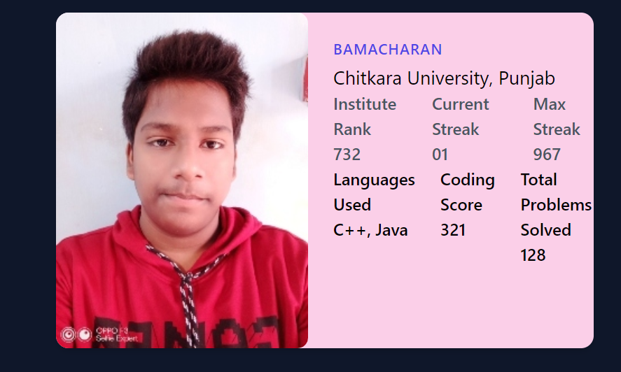
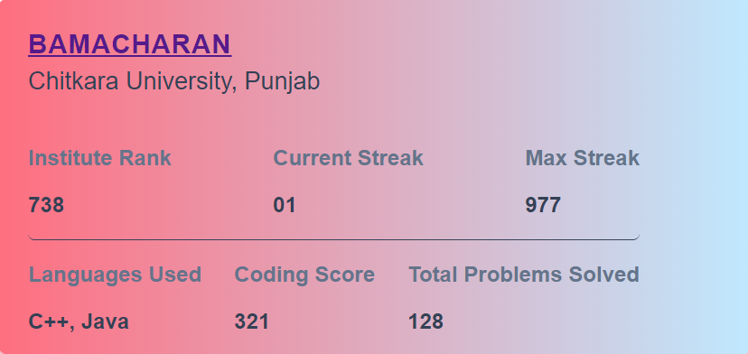

# React-GFG

Collection of components for showcasing your Geek for Geeks profile in your portfolio ✨. Built with [React](https://react.dev) and [CSS](https://developer.mozilla.org/en-US/docs/Web/CSS)


### Read Full Blog
[bamacharan.hashnode.dev/introducing-react-gfg](https://bamacharan.hashnode.dev/introducing-react-gfg-fetch-your-geek-for-geeks-profile-details-with-ease/)

<!--  -->


<!-- This will create a table with two rows and three columns in the first row, and two columns in the second row, with each cell containing an image. Adjust the file paths (`images/image1.png`, `images/image2.png`, etc.) according to your actual file locations. -->

## Features

- 📈 Clean and simple GFG stats, as reusable components
- 🎨 Customizable themes and styles
- 🎉 Fully customizable using CSS 
- 🍀 Open source - [MIT License](./LICENSE)
<!-- - ⚙️ Extended-Components: `activity`, `contest`, `heatmap` and `recent-submission` -->

## Installation

With npm:

```bash
npm install react-gfg
```

With Yarn:

```bash
yarn add react-gfg
```

## Usage

Each Component has their own default properties. You can overwrite the defaults by passing props into the loaders.

### Example

```tsx
import { GFGProfile } from "react-gfg";

function App() {
  return (
    <div className="w-full flex justify-center items-center">
      <GFGProfile username="bamacharan" />
    </div>
  );
}

export default App;
```
<!-- ## Demo Screenshots -->


## Profile Picture Change with `img` prop
```tsx
import { GFGProfile } from "react-gfg";

function App() {
  return (
    <div className="w-full flex justify-center items-center">
      <GFGProfile username="bamacharan" img={"imageURL.png"}/>
    </div>
  );
}

export default App;
```
<!-- ## Demo Screenshots -->

## Remove Profile Picture with `showImg` prop
```tsx
import { GFGProfile } from "react-gfg";

function App() {
  return (
    <div className="w-full flex justify-center items-center">
      <GFGProfile username="bamacharan" ShowImg={"none"}/>
    </div>
  );
}

export default App;
```
<!-- ## Demo Screenshots -->


<!-- ## Component Props

### UserProfilDetails Props
| Name             | Type                            | Default Value                             | Description                                                                             |
|------------------|---------------------------------|--------------------------------------------|-----------------------------------------------------------------------------------------|
| `userName`       | `string`                        | -                                          | The username for which the profile details will be fetched and displayed.               |
| `theme`          | `{ primaryColor?: string; secondaryColor?: string; bgColor?: string; }` | `{ primaryColor: "rgba(34,211,238,1)", secondaryColor: "rgba(209,213,219,1)", bgColor: "rgba(68,64,60,1)" }` | An object defining the colors for the profile details component.                        |
| `loadingComponent` | `ReactNode`                  | -                                          | A custom loading component to be displayed while fetching data.                         |
| `showRank`       | `boolean`                       | `true`                                     | Indicates whether to display the user's rank.                                           |
| `hideLocation`   | `boolean`                       | `false`                                    | Indicates whether to hide the user's location information.                              |
| `hideSchool`     | `boolean`                       | `false`                                    | Indicates whether to hide the user's school information.                                 |
| `hideWebsite`    | `boolean`                       | `false`                                    | Indicates whether to hide the user's website information.                                |
| `hideSkills`     | `boolean`                       | `false`                                    | Indicates whether to hide the user's skills information.                                  |
| `hideCompany`    | `boolean`                       | `false`                                    | Indicates whether to hide the user's company information. 
| `ref`               | `React.Ref<HTMLDivElement>`         | -                                | The ref to attach to the component's root element.                     |

### UserSolvedProblemsStats & UserHeatMap Props

| Name              | Type                               | Default Value                    | Description                                                                                                           |
|-------------------|------------------------------------|----------------------------------|-----------------------------------------------------------------------------------------------------------------------|
| `userName`        | `string`                           | -                                | The username of the user.                                                                                             |
| `loadingComponent`| `React.ReactNode`                  | -                                | Custom loading component to be displayed.                                                                             |
| `theme`           | `{ primaryColor?: string; secondaryColor?: string; bgColor?: string; }` | `{ primaryColor: "rgba(34,211,238,1)", secondaryColor: "rgba(209,213,219,1)", bgColor: "rgba(68,64,60,1)" }` | An object containing custom theme colors.                                                                                                              
| `showUserName`    | `boolean`                            | `true`                             | Flag indicating whether to show the user's name.                                                                      |
| `ref`               | `React.Ref<HTMLDivElement>`         | -                                | The ref to attach to the component's root element.                                                                    |

### UserRecentSubmission & UserContestInfo Props

| Name                  | Type                               | Default Value                    | Description                                                                                                           |
|-----------------------|------------------------------------|----------------------------------|-----------------------------------------------------------------------------------------------------------------------|
| `userName`            | `string`                           | -                                | The username of the user.                                                                                             |
| `loadingComponent`    | `JSX.Element`                      | -                                | The loading component to display.                                                                                     |
| `theme`               | `{ primaryColor?: string; secondaryColor?: string; bgColor?: string; }` | `{ primaryColor: "rgba(34,211,238,1)", secondaryColor: "rgba(209,213,219,1)", bgColor: "rgba(68,64,60,1)" }` | The theme configuration object containing primaryColor, secondaryColor, and bgColor fields.                         |
| `ref`                 | `React.Ref<HTMLDivElement>`        | -                                | The ref to attach to the component's root element.                                                            |

- If you dont provide loading component the default loader will appear
```tsx
<div id="loading_container" className="flex flex-col">
    <div id="loading_dots_container" className="flex items-center justify-center gap-2 animate-pulse">
        <div className="w-1 h-1 bg-gray-600 rounded-full" />
        <div className="w-1 h-1 bg-gray-600 rounded-full" />
        <div className="w-1 h-1 bg-gray-600 rounded-full" />
    </div>
    <p id="loading_text" className="text-[10px] text-white font-bold text-center ml-[12px]">Loading...</p>
</div>
```

## Note
If you simply use this component it will throw `CORS` error.
 - While developing setup the proxy.

  - Ex: Incase you are using vite for your react project add this to `vite.config.ts`:
```ts
import { defineConfig } from 'vitest/config';
import react from '@vitejs/plugin-react';
export default defineConfig({
  plugins: [react()],

  // Add this part to your config file
  server: {
    open: true,
    cors:  true,
    proxy: {
      '/leetcode': {
        target: 'https://leetcode.com/graphql',
        changeOrigin: true,
        secure: false,
        rewrite: (path) => path.replace(/^\/leetcode/, '')
      },
    }
  },
})
```

- While deploying the website you should configure reverse proxy from the deployment platform.
- Ex: If you are deploying your site in vercel add `vercel.json` file to the roor of your project folder with this content.
```json
// vercel.json
{
    "rewrites": [
      {
        "source": "/leetcode",
        "destination": "https://leetcode.com/graphql"
      }
    ]
}
``` -->

# CSS Structure

The `GFGProfile` component uses the following CSS classes and styles:

## Base Styles

- `.card`: Styles for the main container of the profile card.
- `.profile-container`: Styles for the container that holds the profile image and information.
- `.image-container`: Styles for the container that holds the profile image.
- `.profile-image`: Styles for the profile image itself.
- `.info-container`: Styles for the container that holds the user's information.
- `.username`: Styles for the username text.
- `.institution`: Styles for the institution text.
- `.info-row`: Styles for the row that contains the institute rank, current streak, and max streak.
- `.info`: Styles for the labels in the information sections.
- `.value`: Styles for the values in the information sections.
- `.info-main`: Styles for the main information section that contains languages used, coding score, and total problems solved.
- `.error`: Styles for the error message when the username is not provided.

## Customizable Styles

### Colors

- `body`: Change the font family for the entire component.
- `.card`: Change the background color and gradient of the main card container.
- `.username`: Change the color and font weight of the username.
- `.username a:hover`: Change the color of the username link on hover.
- `.institution`: Change the color and font size of the institution text.
- `.info-row`: Change the color and border styles of the information row.
- `.info`: Change the font weight of the information labels.
- `.value`: Change the color and font weight of the information values.

### Dimensions

- `.card`: Change the maximum width and border radius of the main card container.
- `.image-container`: Change the width and height of the profile image container.
- `.profile-image`: Change the object-fit property of the profile image.
- `.profile-image:hover`: Change the scale transformation of the profile image on hover.
- `.info-container`: Change the padding of the information container.

### Animations

- `.profile-image`: Add or modify the transition animation for the profile image on hover.

## Additional Customizations

You can also add or modify other styles as needed, such as font styles, spacing, and layout adjustments, by targeting the appropriate CSS classes or creating new ones. </br>
For more information [here](src/stories/GFGProfile.css)


## Development
- clone the repo
```bash
git clone https://github.com/BamaCharanChhandogi/react-gfg.git
```
- Install the packages
```bash
npm install
#or
yarn install
```

- To run example website
```bash
cd example

npm run dev
#or
yarn dev
```

<!-- ## Testing
This package uses [Vitest](https://vitest.dev) and [React-Testing Library](https://testing-library.com/docs/react-testing-library/intro/) -->

- Run the test
```bash
npm run test
#or
yarn test
```


## Contributing
If you would like to contribute to this project, please follow these steps:

- Fork the repo
- Clone the repo `git clone https://github.com/BamacharanChhandogi/react-gfg.git`
- Create your feature branch (`git checkout -b feature/YourFeature`)
- Commit your changes (`git commit -am 'Add some feature'`)
- Push to the branch (`git push origin feature/YourFeature`)
- Create a new Pull Request

## License
`react-gfg` is released under the MIT license.

<!-- ## References
1. [React](https://react.dev)
2. [Vite](https://vite.dev)
3. [Tailwindcss](https://tailwindcss.com)
4. [Vitest](https://vitest.dev)
5. [Leetcode-Stats-Card](https://github.com/JacobLinCool/LeetCode-Stats-Card)
6. [Leetcode-Query](https://github.com/JacobLinCool/LeetCode-Query)
7. [Create-library-fast-blog](https://dev.to/receter/how-to-create-a-react-component-library-using-vites-library-mode-4lma)
8. [Testing-blog](https://medium.com/@masbagaspn/unit-testing-react-application-with-vitest-and-react-testing-library-910f6f4dc675) -->

## Thank You
